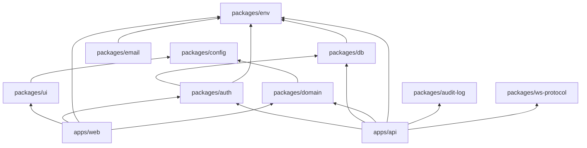

# Deep research brief — padel-codebase-readiness-prep

**Question:** What must we prepare in this codebase to meet intent, goals, stack, AI-agent harness, BMAD (not set up yet), and future MVPs?  
**Depth:** adversarial-deep | **Output:** files-only | **Boundary:** public-extended | **Languages:** en  
**Generated:** 2026-07-30

---

## answer

The paadel.app codebase must be **layered, env-guarded, and smoke-testable** before MVP1 feature work. Preparation splits into **foundation (Phase D)**, **MVP1 vertical slice**, and **harness/BMAD (optional, non-blocking)**.

### Readiness checklist (from locked stack + research)

| Layer | Prepare now | Smoke gate | Blocker if missing |
| --- | --- | --- | --- |
| **Monorepo** | Turborepo + Bun workspaces | `bun run build` | Cannot share packages |
| **Lint/format** | Biome + ultracite + lefthook | `biome check` | Style drift, agent errors |
| **Env** | `packages/env` t3 pattern, all apps | Fail on missing `DB_URL` | Silent prod misconfig |
| **DB** | Drizzle schema + audit fields + migrate | `db:migrate` against Postgres | No persistence |
| **Auth** | Better Auth email + GitHub + org schema prep | Login flow on dev | No MVP1 loop |
| **API** | Elysia + Zod + Scalar + OTel + evlog | `/health`, `/docs` | No client data path |
| **Web** | Next client-first + TanStack Query + Mantine | `/` placeholder + `/app` shell | No player UX |
| **Domain** | Zod schemas Match/Invite/Player | Typecheck packages/domain | Schema drift |
| **Redis** | Client + connectivity check | Ping in API startup | Cache/pubsub blocked |
| **R2** | S3-compatible client + env prefix | Upload test object | File features blocked |
| **Email** | Resend + React Email package | Send stub in dev | Invite email blocked |
| **WebSocket** | `packages/ws-protocol` + handshake | WS connect smoke | Live roster MVP2 |
| **Audit log** | `packages/audit-log` wired on key actions | Log match.create | Compliance gap |
| **Deploy** | Docker Compose dev + Coolify notes | stg deploy doc | No stg validation |

### Package dependency graph (strict)

**Rule:** Apps import packages; packages never import apps. `packages/domain` has zero infra deps.

### AI-agent harness readiness

| Need | Prepare on disk | BMAD required? |
| --- | --- | --- |
| Stack disputes | `docs/tech-stack.md` | No |
| Domain terms | `docs/product/mvp1-brief.md` + `packages/domain` | No |
| Decisions | `docs/adr/*.md` | No |
| Research context | `docs/research/*/` | No |
| Agent rules | Existing `.cursor/rules/` | No |
| BMAD method | Not installed — optional proposal only | **No for MVP1** |

**Agent-readable code principles:** explicit package names (`@paadel/*`), Zod-inferred types, fail-fast env, one behavior per module, no hidden Server Actions in web app.

### MVP1 vertical slice (after smoke gates)

1. Auth: register/login (email + GitHub)
2. API: `POST /matches`, `POST /matches/:id/invites`, `POST /invites/:id/accept`
3. Web: create match form, invite link, accept UI, history list
4. Audit: log `match.created`, `invite.sent`, `invite.accepted`
5. Deploy: Coolify stg + Doppler secrets

### Future MVP prep (schema-only where cheap)

| Future MVP | Prep now | Active later |
| --- | --- | --- |
| Multi-tenant org UX | `organizationId` nullable on tables + Better Auth org plugin | MVP3+ |
| Court booking | `Court`/`Booking` stubs in domain doc only | MVP3+ |
| Americano events | `EventFormat` enum in domain | MVP2 |
| Realtime roster | Redis pub/sub + ws-protocol types | MVP1.1 |
| SEO homepage | `/` route exists as placeholder | MVP3+ |

### Known stack integration notes

- **Better Auth + Elysia:** mount handler on API; web uses auth client (no Server Actions) [S1][S2].
- **Drizzle + Better Auth:** share schema in `packages/db` [S1].
- **Next.js client-first:** TanStack Query → Elysia REST; no RSC data fetching for features [docs/tech-stack.md].
- **Scalar/OpenAPI:** `@elysiajs/openapi` with Scalar provider if `@scalar/elysia` unavailable.
- **Mantine v7** pinned for React 19 stable compatibility.

### CI / governance gaps to close post-scaffold

- Wire `.github/workflows/ci.yml` to `bun run build` + `biome check`
- Add `docker compose` service check in CI optional job
- Pre-push lefthook already present at repo root

**Headline confidence: 74/100**

---

## reasoning

Codebase readiness is not feature completeness — it is **provably wired layers**. Research briefs #1–#3 define *what* to build; this brief defines *gates* before building. Monorepo scaffold satisfies structural readiness; runtime gates (Postgres migrate, Redis, R2, auth OAuth) require Docker + secrets.

BMAD explicitly deferred per orchestrator — document proposals in product brief, do not block.

---

## confidence

**Headline: 74/100** — stack patterns verified via templates and docs [S1][S2][S3]; runtime smoke partially executed by scaffold agent.

---

## conflicts

- shadcn/Tailwind templates common in Better Auth turborepo tutorials [S1] — **rejected** by `docs/tech-stack.md` (Mantine only).

---

## unverified

- evlog drain production config on Coolify
- Doppler → Coolify secret injection pattern for this VPS
- Ultracite strict ruleset compatibility with Mantine imports

---

## references

[S1] Better Auth + Turborepo + Drizzle patterns, nerd-stack-auth-sample / tutorials, 2025–2026.  
[S2] create-ej-app stack documentation, github.com/ejekanshjain/create-ej-app.  
[S3] docs/tech-stack.md, paadel.app repo, 2026-07-30.

---

## recommendation

Run smoke script (`scripts/smoke.sh` or turbo task) aggregating: build, typecheck, biome, api health, db migrate, redis ping. Block MVP1 feature PRs until green.
