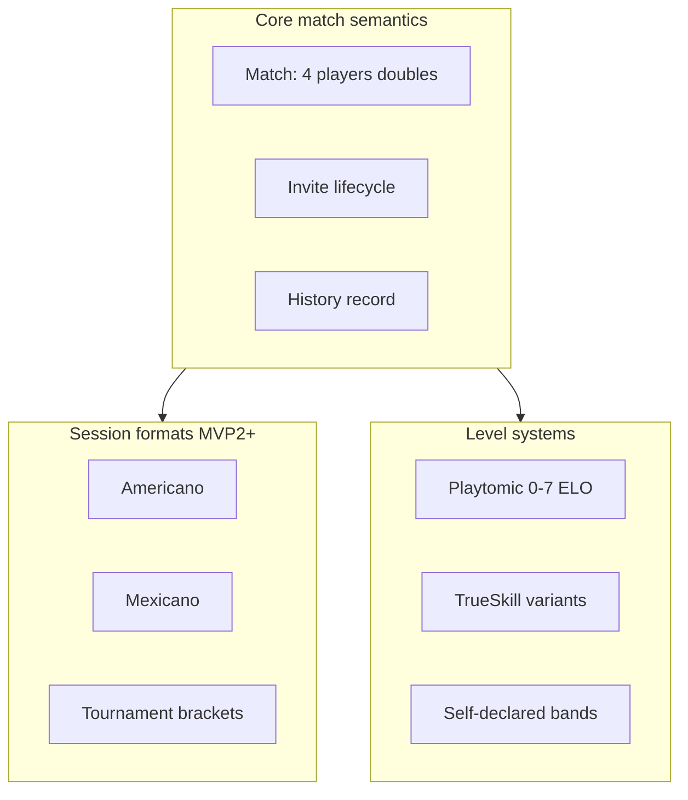

# Deep research brief — padel-domain-enhancement-opportunities

**Question:** Padel-domain knowledge that could enhance/upgrade paadel.app.  
**Depth:** adversarial-deep | **Output:** files-only | **Boundary:** public-extended | **Languages:** en  
**Generated:** 2026-07-30

---

## answer

Padel domain knowledge beyond "book a court" clusters into **formats**, **level systems**, **social session design**, and **competitive structures**. For paadel.app, the highest-value domain embeds are **match lifecycle semantics**, **skill band vocabulary**, and **session formats** (MVP2+).

### Domain knowledge map

### 1. Match & scoring fundamentals

- Standard padel is **doubles** (4 players). Singles exists but is niche.
- Standard scoring: **15-30-40-game-set** with golden point/deuce variants; **FIP 2026 Star Point** rules emerging [S5].
- Casual friendly matches often skip formal scoring in apps — only record **winner / optional set scores**.

**paadel.app MVP1 implication:** Match entity needs 4 slots (or flexible 2–4 for partial fill), status machine: `draft → open → confirmed → played → cancelled`.

### 2. Session formats (enhancement opportunities)

| Format | Rules summary | App complexity | MVP fit |
| --- | --- | --- | --- |
| **Friendly doubles** | Fixed partners, standard or casual scoring | Low | **MVP1** |
| **Americano** | Individual points; partners rotate on fixed schedule; 16/24/32 points per round [S1][S2] | Medium | MVP2 |
| **Mexicano** | Like Americano but dynamic re-pairing by leaderboard after each round [S1][S3] | High | MVP2 |
| **Team Americano** | Top-ranked pair together each round [S4] | Medium | MVP2+ |
| **Tournament knockout** | Brackets, seeds | High | MVP3+ / club |

Organizers use apps (PadelFast, Playtomic, PadelManager) because **manual rotation is painful above 8 players** [S1][S4].

### 3. Level / skill vocabulary

| System | Range | Behavior | User expectation |
| --- | --- | --- | --- |
| **Playtomic-style** | 0–7 | Dynamic ELO + reliability % | Dominant in club markets |
| **Self-declared bands** | 1–10 descriptive | Quick matchmaking | Casual groups |
| **TrueSkill / OpenSkill** | Custom (0–25, 0–7) | Verified multi-player confirm | Competitive niche |

**MVP1 recommendation:** Store optional `skillLevel` as **self-declared 1–7 or beginner/intermediate/advanced** — defer algorithmic rating. Display Playtomic-compatible bands in help text for familiarity without claiming interoperability.

### 4. Social & session design patterns

- **Host role** is central — creator sets time/place, invites, approves joiners (Padel Mixer model) [S6].
- **WhatsApp is the behavioral incumbent** — apps win by being simpler than a group chat thread [S6].
- **8–16 players** is the sweet spot for Americano/Mexicano club nights [S2][S3].
- **Every point matters** in Americano — cumulative scoring means early rounds affect final standings [S2].

### 5. Domain features that upgrade the app (prioritized)

| Priority | Domain feature | Why |
| --- | --- | --- |
| P0 | **Invite link + roster + status** | Core padel social unit is the 4-player box |
| P0 | **Match history with who played** | Players reference past games constantly |
| P1 | **Optional location/court label** (free text) | No booking still needs "where" |
| P1 | **Host approve/decline joiners** | Trust in open invites |
| P2 | **Set score capture** (optional) | Post-game record |
| P2 | **Padel side preference** (left/right)** | Advanced matching — niche |
| P3 | **Americano rotation engine** | Club/session organizer tool |
| P3 | **Golden point / deuce rule flag** | Scoring pedants |
| P4 | **Federation license / WPR ID** | Competitor segment |

### 6. Terminology (ubiquitous language seed)

| Term | Meaning in paadel.app |
| --- | --- |
| **Player** | Authenticated user |
| **Match** | A scheduled padel session (usually doubles) |
| **Invite** | Request for a Player to join a Match |
| **Host** | Player who created the Match |
| **Participant** | Player who accepted an Invite |
| **Open slot** | Unfilled position in a 4-player match |
| **Casual match** | Non-tournament, MVP1 default |

**Headline confidence: 76/100**

---

## reasoning

Domain research confirms MVP1 should not over-index on tournament formats. The **friendly doubles + invite** loop matches how most casual players actually play. Americano/Mexicano is high-value MVP2 because it drives repeat organizer use and justifies WebSocket live leaderboards — but requires rotation logic [S1][S3][S4].

Level systems are culturally loaded — Playtomic 0–7 is the reference dialect even when inaccurate [prior brief]. Starting with self-declared bands avoids cold-start algorithm problems.

---

## confidence

**Headline: 76/100** — format rules well-documented in T2 sports blogs; FIP rule changes need primary FIP source for production scoring engine.

---

## conflicts

- Americano round length: 16 vs 21 vs 24 vs 32 points cited across sources [S1][S2][S4] — configurable per event, not hardcoded.

---

## unverified

- FIP 2026 Star Point adoption rate in recreational play
- Optimal default skill scale for global English audience

---

## references

[S1] SimplePadel, "Padel Americano: How to Play," simplepadel.com. Accessed: 2026-07-30.  
[S2] Live For Padel, "Padel Americano Rules," liveforpadel.com. Accessed: 2026-07-30.  
[S3] PadelFast, "Americano vs Mexicano," padelfast.com. Accessed: 2026-07-30.  
[S4] PadelFast, "Organize Americano Tournament," padelfast.com. Accessed: 2026-07-30.  
[S5] PADLR., "Star Point (FIP 2026) deuce rules," playpadlr.app. Accessed: 2026-07-30.  
[S6] Padel Mixer, padelmixer.app. Accessed: 2026-07-30.

---

## recommendation

Encode domain in `packages/domain` Zod schemas with explicit match status enum and invite states. Defer Americano engine to MVP2 ADR when requested.
